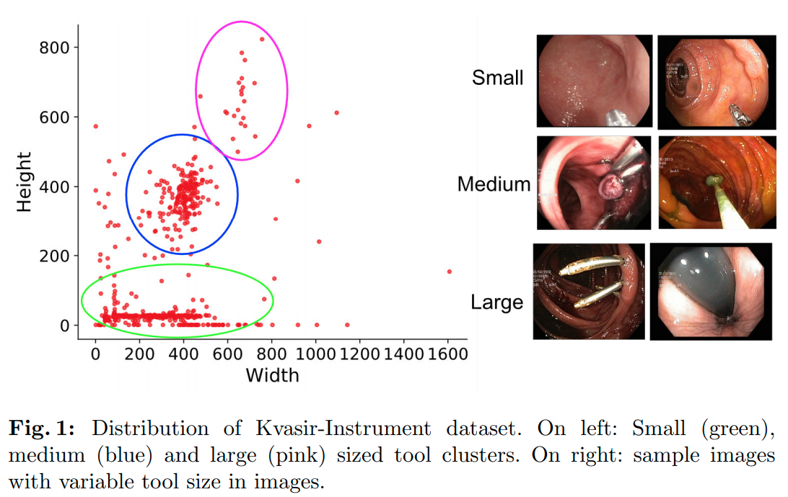
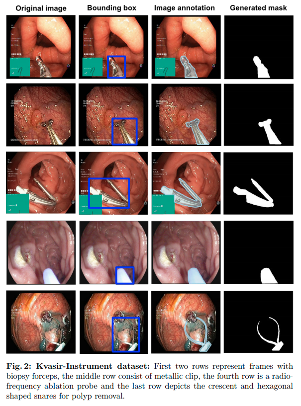
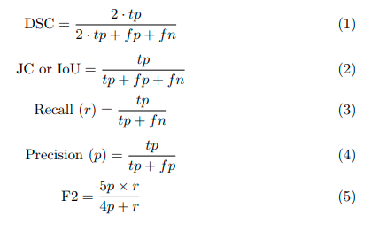
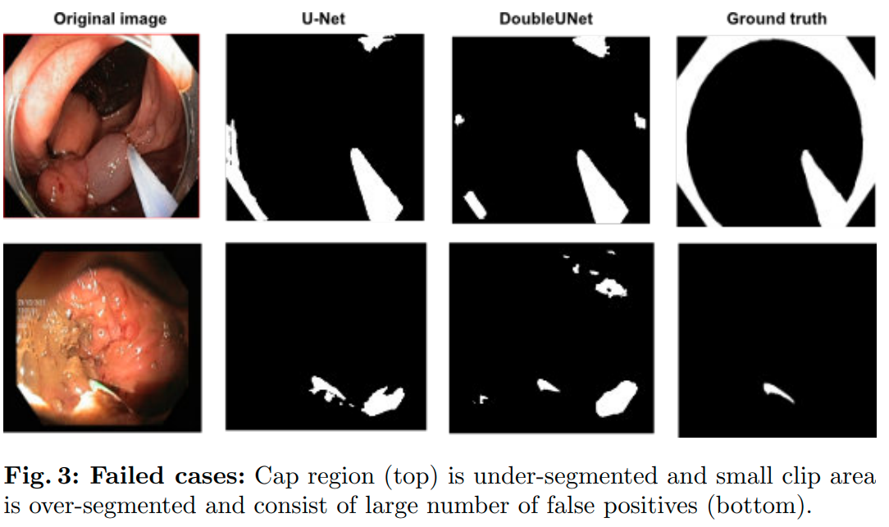

## Kvasir-Instrument: Diagnostic and therapeutic tool segmentation dataset in gastrointestinal endoscopy contains the information about the Kvasir-Instrument dataset

🔍 Use-Cases:

- Automatic surgical instrument segmentation
- Data augmentation studies
- Benchmarking of the different deep learning methods
- Transfer learning
- Model interpretability studies

## Dataset information: 
The Kvasir-Instrument dataset includes 590 frames consisting of various GI endoscopy tools used during both endoscopic surveillance and therapeutic or surgical procedures. Moreover, information about the dataset uses, their application, annotation protocol can be found from their webpage.

## Downloadable link: 

The dataset can be downloaded from [https://datasets.simula.no/kvasir-instrument/](https://datasets.simula.no/kvasir-instrument/).

## Research and publication

[Arxiv](https://arxiv.org/abs/2011.08065)

[OSF preprint](https://osf.io/s5d48/)

[Original publication](https://link.springer.com/chapter/10.1007/978-3-030-67835-7_19)

## Evaluation metrics
We suggest evaluation metrics such as dice coefficient, Jaccard index, recall, precision, and F2.
Their description can be found here. 

## Results on challenging images
The figure shows the results on the challenging images. 

## Citation
Please cite our paper if you find the work useful: 
<pre>
@inproceedings{jha2021kvasir,
  title={Kvasir-instrument: Diagnostic and therapeutic tool segmentation dataset in gastrointestinal endoscopy},
  author={Jha, Debesh and Ali, Sharib and Emanuelsen, Krister and Hicks, Steven A and Thambawita, Vajira and Garcia-Ceja, Enrique and Riegler, Michael A and Lange, Thomas de and Schmidt, Peter T and Johansen, H{\aa}vard D and others},
  booktitle={Proceedings of the International Conference on Multimedia Modeling},
  pages={218--229},
  year={2021},
  organization={Springer}}
</pre>

## Contact
please contact debesh.jha@northwestern.edu for any further questions. 
